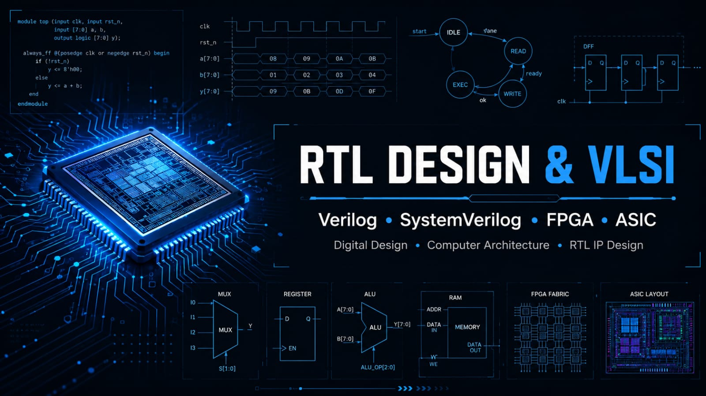

  

  

  

<h1 align="center">Hi, I'm Pruthviraj Kalashetty 👋</h1>

<h3 align="center">
RTL Design • Digital Design • Verilog HDL • FPGA • VLSI
</h3>

  

  

  

---

# 👨‍💻 About Me

🎓 B.Tech in Electronics & Communication Engineering, LAEC Bidar

💡 Passionate about

- RTL Design
- Digital Design
- Verilog HDL
- FPGA Design
- VLSI

🌱 Currently Learning

- Digital Design Fundamentals
- Verilog HDL
- RTL Design
- FPGA Design
- Computer Architecture

🎯 Career Goal

To become an RTL Design Engineer specializing in ASIC and FPGA Design.

---

# 🛠 Tech Stack

### Languages

- Verilog HDL

### Tools

- AMD Vivado
- ModelSim
- GTKWave
- Git
- GitHub

### Hardware Concepts

- Combinational Logic
- Sequential Logic
- Finite State Machines (FSM)
- RTL Design
- FPGA Design Flow
- Timing Analysis

---

# 📂 Hardware Engineering Portfolio

My GitHub portfolio is organized into specialized repositories that follow a structured RTL Design learning path.

## 📘 Digital Systems & VLSI

Foundations of digital electronics, Boolean algebra, combinational logic, sequential logic, timing concepts, and VLSI fundamentals.

🔗 https://github.com/pruthviraj-kalashetty/Digital-Systems-and-VLSI

---

## 💻 Verilog Practice

RTL implementation of digital building blocks using Verilog HDL with simulation and verification.

Topics include

- Logic Gates
- Adders & Subtractors
- Multiplexers
- Decoders
- Encoders
- Comparators
- Code Converters
- Counters
- Registers
- FSMs

🔗 https://github.com/pruthviraj-kalashetty/Verilog-Practice

---

## 🖥 Computer Architecture

Learning modern processor architecture including

- CPU Organization
- Datapath
- Control Unit
- Pipeline
- Cache Memory
- Memory Hierarchy
- Instruction Set Architecture

🔗 https://github.com/pruthviraj-kalashetty/Computer-Architecture

---

## ⚙ RTL Design IPs

Reusable RTL IP cores designed in Verilog HDL.

Examples include

- ALU
- UART
- SPI
- I²C
- FIFO
- PWM
- Timers
- Clock Divider
- Register File

🔗 https://github.com/pruthviraj-kalashetty/RTL-Design-IPs

---

## 🚀 System-Level Digital Projects

Integration of multiple RTL modules into complete digital systems.

Examples

- Traffic Light Controller
- Elevator Controller
- Vending Machine
- Digital Clock
- Calculator
- Memory-Based Systems

🔗 https://github.com/pruthviraj-kalashetty/System-Level-Digital-Projects

---

## 🔷 FPGA Projects

Implementation of RTL designs on FPGA using AMD Vivado.

Includes

- Synthesis
- Implementation
- Bitstream Generation
- Hardware Validation
- FPGA Prototyping

🔗 https://github.com/pruthviraj-kalashetty/FPGA-Projects

---

# 📚 Currently Learning

- Digital Design
- RTL Design
- Verilog HDL
- Computer Architecture
- FPGA Development

---

# 📫 Connect

📧 Email: your@email.com

💼 LinkedIn: https://linkedin.com/in/yourprofile

---

RTL Design • ASIC • FPGA • Digital Systems • Computer Architecture

